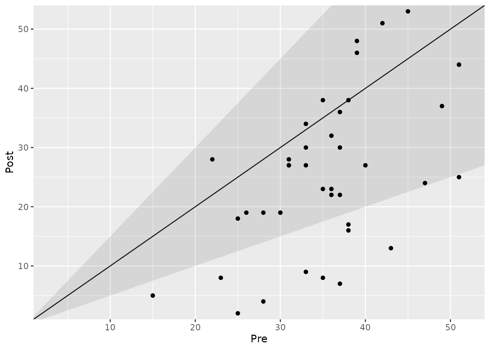
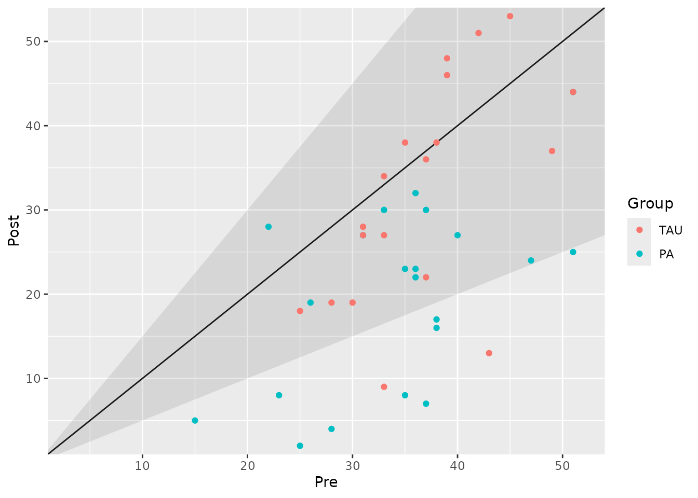

# Analyzing Clinical Significance: The Percentage-Change Approach

## Introduction

The percentage-change approach defines clinical significance based on
the **relative change** in a patient’s score from baseline. This method
is common in clinical trials where a specific reduction in symptoms,
such as “a 50% improvement,” is a primary endpoint for defining
treatment response.

A change is considered clinically significant if it meets or exceeds a
predefined **Percentage-Change Cutoff (PCC)**. For example, if the PCC
is 50% (or 0.5), any patient who shows at least a 50% reduction in
symptoms would be classified as “Improved”.

A key consideration for this method is that it is **highly dependent on
the patient’s baseline score**. A 10-point drop is a 50% improvement for
a patient starting at 20 points, but only a 25% improvement for a
patient starting at 40 points. This characteristic should be kept in
mind when interpreting the results.

This vignette demonstrates how to use the
[`cs_percentage()`](https://benediktclaus.github.io/clinicalsignificance/reference/cs_percentage.md)
function to apply this approach.

``` r
library(clinicalsignificance)
```

## Basic Analysis

Let’s analyze the `claus_2020` dataset. A common benchmark for
depression treatment trials is a 50% reduction in symptom scores. We
will set this as our `pct_improvement` cutoff.

``` r
# Analyze change using a 50% improvement cutoff
pct_results <- claus_2020 |>
  cs_percentage(
    id = id,
    time = time,
    outcome = bdi,
    pre = 1,
    post = 4,
    pct_improvement = 0.5
  )

summary(pct_results)
#> 
#> ---- Clinical Significance Results ----
#> 
#> Approach:                 Percentage-based
#> Percentage Improvement:   50.00%
#> Percentage Deterioration: 50.00%
#> Better is:                Lower
#> N (original):             43
#> N (used):                 40
#> Percent used:             93.02%
#> Outcome:                  bdi
#> 
#> Category     |  N | Percent
#> ---------------------------
#> Improved     | 11 |  27.50%
#> Unchanged    | 29 |  72.50%
#> Deteriorated |  0 |   0.00%
```

The summary shows that based on this 50% criterion, about 28% of
patients are classified as having improved.

### Visualizing the Results

The plot for the percentage-change approach looks similar to those for
the anchor- and distribution-based methods. However, the shaded area is
now determined by the percentage-change cutoff relative to each
individual’s starting score. This means the boundaries of the
“unchanged” area are not parallel lines.

``` r
plot(pct_results)
#> Ignoring unknown labels:
#> • colour : "Group"
```



## Grouped Analysis

We can also explore if the proportion of “responders” differs between
the treatment groups (TAU vs. PA).

``` r
# Grouped analysis with a 50% improvement cutoff
pct_grouped <- claus_2020 |>
  cs_percentage(
    id = id,
    time = time,
    outcome = bdi,
    pre = 1,
    post = 4,
    pct_improvement = 0.5,
    group = treatment
  )

summary(pct_grouped)
#> 
#> ---- Clinical Significance Results ----
#> 
#> Approach:                 Percentage-based
#> Percentage Improvement:   50.00%
#> Percentage Deterioration: 50.00%
#> Better is:                Lower
#> N (original):             43
#> N (used):                 40
#> Percent used:             93.02%
#> Outcome:                  bdi
#> 
#> Group |     Category |  N | Percent | Percent by Group
#> ------------------------------------------------------
#> TAU   |     Improved |  2 |   5.00% |           10.53%
#> TAU   |    Unchanged | 17 |  42.50% |           89.47%
#> TAU   | Deteriorated |  0 |   0.00% |            0.00%
#> PA    |     Improved |  9 |  22.50% |           42.86%
#> PA    |    Unchanged | 12 |  30.00% |           57.14%
#> PA    | Deteriorated |  0 |   0.00% |            0.00%
```

The results suggest that a much higher proportion of patients in the
Placebo Amplification (PA) group (42.9%) achieved a 50% symptom
reduction compared to the Treatment as Usual (TAU) group (10.5%).

The plot clearly visualizes this difference:

``` r
plot(pct_grouped)
```



## Using Different Cutoffs for Improvement and Deterioration

A useful feature of
[`cs_percentage()`](https://benediktclaus.github.io/clinicalsignificance/reference/cs_percentage.md)
is the ability to set different cutoffs for improvement and
deterioration via the `pct_deterioration` argument. For instance, in
some contexts, a small worsening of symptoms (e.g., 20%) might already
be considered a significant deterioration, while a larger change (e.g.,
50%) is required for improvement.

``` r
pct_asymmetric <- claus_2020 |>
  cs_percentage(
    id = id,
    time = time,
    outcome = bdi,
    pre = 1,
    post = 4,
    pct_improvement = 0.5,
    pct_deterioration = 0.2 # A smaller threshold for worsening
  )

summary(pct_asymmetric)
#> 
#> ---- Clinical Significance Results ----
#> 
#> Approach:                 Percentage-based
#> Percentage Improvement:   50.00%
#> Percentage Deterioration: 20.00%
#> Better is:                Lower
#> N (original):             43
#> N (used):                 40
#> Percent used:             93.02%
#> Outcome:                  bdi
#> 
#> Category     |  N | Percent
#> ---------------------------
#> Improved     | 11 |  27.50%
#> Unchanged    | 26 |  65.00%
#> Deteriorated |  3 |   7.50%
```
