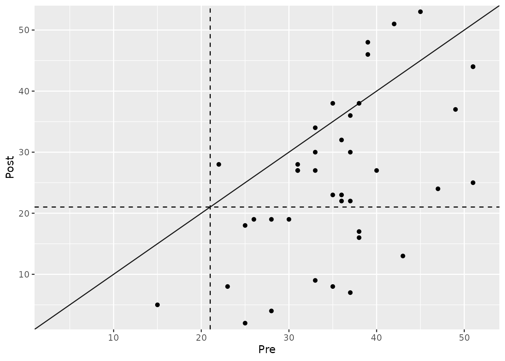

# Analyzing Clinical Significance: The Statistical Approach

## Introduction

The statistical approach to clinical significance evaluates whether a
patient has **moved from a dysfunctional (“clinical”) population to a
functional (“non-clinical”) population** as a result of an intervention.
This method is based on the idea that a meaningful change involves not
just a reduction in symptoms, but a transition to a state of healthy
functioning.

To apply this method, we must first define the score distributions of
both the clinical and functional populations. From these, we calculate a
**cutoff score** that optimally separates the two groups. A patient is
then considered to have made a clinically significant change if they
were in the clinical range before treatment and in the functional range
after treatment.

This vignette demonstrates how to use the
[`cs_statistical()`](https://benediktclaus.github.io/clinicalsignificance/reference/cs_statistical.md)
function to perform this analysis. It’s important to note that this
method is a key component of the powerful **Combined Approach**, which
is often the most informative way to assess clinical significance.

``` r
library(clinicalsignificance)
```

## Defining Populations and Calculating a Cutoff

The most crucial step in this approach is defining the functional
population. This requires obtaining summary statistics (mean and
standard deviation) for the outcome measure from a relevant non-clinical
or healthy sample.

For our example using the BDI-II from the `claus_2020` dataset, we will
use normative data from Kühner et al. (2007), who reported a mean of
7.69 and a standard deviation of 7.52 for a German non-clinical sample.

The `clinicalsignificance` package provides three methods for
calculating the cutoff, specified by the `cutoff_type` argument: -
**`"a"`**: Based only on the clinical sample’s distribution. -
**`"b"`**: Based on the functional sample’s mean and the clinical
sample’s standard deviation. - **`"c"`**: **(Recommended)** Incorporates
the mean and standard deviation from *both* the clinical and functional
populations to find an optimal midway point. This is generally the most
robust and objective choice.

### Example Analysis

Let’s perform the analysis using the recommended cutoff type “c”. The
function will automatically calculate the mean and standard deviation
for the clinical sample from the `claus_2020` pre-treatment data.

``` r
# Perform the statistical analysis
stat_results <- claus_2020 |>
  cs_statistical(
    id = id,
    time = time,
    outcome = bdi,
    pre = 1,
    post = 4,
    m_functional = 7.69,
    sd_functional = 7.52,
    cutoff_type = "c"
  )

summary(stat_results)
#> 
#> ---- Clinical Significance Results ----
#> 
#> Approach:     Statistical
#> Method:       JT
#> N (original): 43
#> N (used):     40
#> Percent used: 93.02%
#> Cutoff type:  c
#> Cutoff:       21.02
#> 
#> -- Cutoff Descriptives
#> 
#> M Clinical | SD Clinical | M Functional | SD Functional
#> -------------------------------------------------------
#> 35.48      |        8.16 |         7.69 |          7.52
#> 
#> 
#> -- Results
#> 
#> Category     |  N | Percent
#> ---------------------------
#> Improved     | 13 |  32.50%
#> Unchanged    | 27 |  67.50%
#> Deteriorated |  0 |   0.00%
```

The summary tells us that the calculated cutoff score is 21.6. Based on
this, 32.5% of patients were classified as “Improved,” meaning they
started above this cutoff (in the clinical range) and ended below it (in
the functional range).

### Visualizing the Results

The plot for the statistical approach is unique. It features two dashed
lines representing the cutoff score on both the pre-treatment (x-axis)
and post-treatment (y-axis). These lines divide the plot into four
quadrants:

- **Top-Right**: Clinical before and after (Unchanged).
- **Bottom-Left**: Functional before and after (Unchanged).
- **Bottom-Right**: Clinical before, functional after (Improved).
- **Top-Left**: Functional before, clinical after (Deteriorated).

``` r
plot(stat_results)
#> Ignoring unknown labels:
#> • colour : "Group"
```



## Grouped Analysis

We can also investigate if the proportion of patients who transitioned
to the functional population differs between the treatment groups (TAU
vs. PA).

``` r
# Grouped statistical analysis
stat_grouped <- claus_2020 |>
  cs_statistical(
    id = id,
    time = time,
    outcome = bdi,
    pre = 1,
    post = 4,
    m_functional = 7.69,
    sd_functional = 7.52,
    cutoff_type = "c",
    group = treatment
  )

summary(stat_grouped)
#> 
#> ---- Clinical Significance Results ----
#> 
#> Approach:     Statistical
#> Method:       JT
#> N (original): 43
#> N (used):     40
#> Percent used: 93.02%
#> Cutoff type:  c
#> Cutoff:       21.02
#> 
#> -- Cutoff Descriptives
#> 
#> M Clinical | SD Clinical | M Functional | SD Functional
#> -------------------------------------------------------
#> 35.48      |        8.16 |         7.69 |          7.52
#> 
#> 
#> -- Results
#> 
#> Group |     Category |  N | Percent | Percent by Group
#> ------------------------------------------------------
#> TAU   |     Improved |  5 |  12.50% |           26.32%
#> TAU   |    Unchanged | 14 |  35.00% |           73.68%
#> TAU   | Deteriorated |  0 |   0.00% |            0.00%
#> PA    |     Improved |  8 |  20.00% |           38.10%
#> PA    |    Unchanged | 13 |  32.50% |           61.90%
#> PA    | Deteriorated |  0 |   0.00% |            0.00%
```

The analysis reveals a substantial difference: 47.6% of patients in the
Placebo Amplification (PA) group moved into the functional range,
compared to only 15.8% in the Treatment as Usual (TAU) group.

The plot makes this difference visually apparent:

``` r
plot(stat_grouped)
```


## Summary and Next Steps

The statistical approach provides a powerful criterion for clinical
significance by focusing on a patient’s **end-state functioning**.

- **Strength**: It defines recovery in an absolute sense (return to
  normality) rather than just relative change.
- **Limitation**: It requires reliable normative data for a functional
  population, which may not always be available. Also, it doesn’t
  consider the *magnitude* of change for patients who do not cross the
  cutoff.

This is why the statistical approach is most powerful when used as part
of a **Combined Approach**, where it is paired with a measure of
reliable or meaningful change. We highly recommend reviewing the
vignette on the **Combined Approach** to see how to integrate these
concepts for the most comprehensive assessment of patient outcomes.
