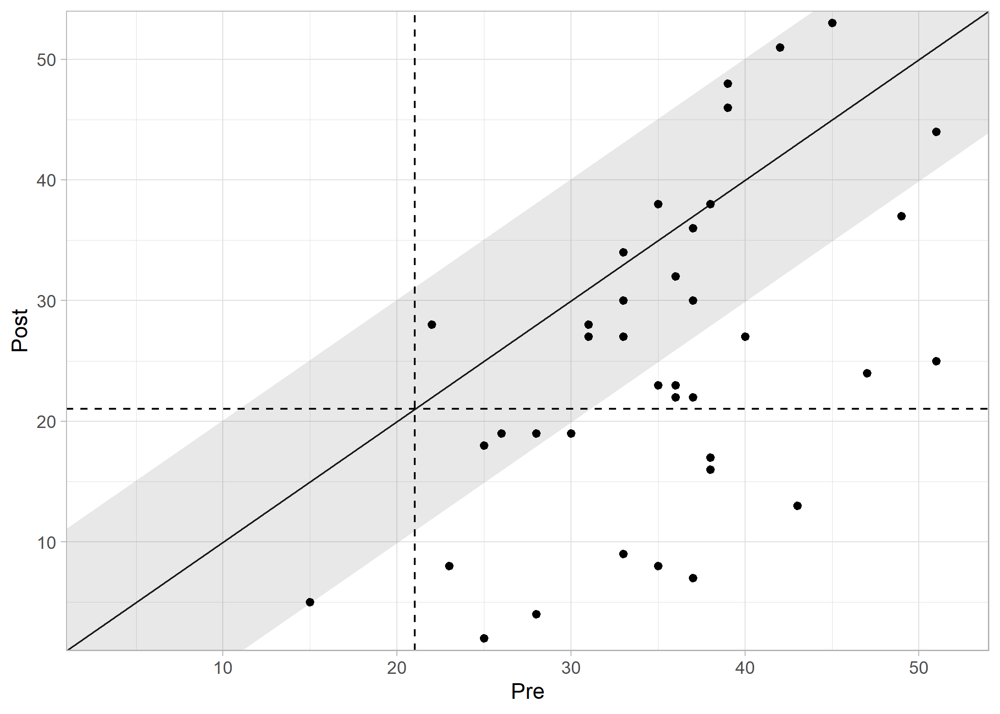

# clinicalsignificance

The **clinicalsignificance** R package provides a comprehensive and
consistent framework for analyzing **clinical significance** in
intervention studies. While *statistical* significance only indicates
whether an effect is unlikely due to chance, clinical significance
addresses the crucial question: Does an intervention lead to a
**practically relevant or meaningful change** for the individual
patient?

This package is designed to help researchers and healthcare
professionals assess the practical relevance of their findings and make
more informed decisions.

## Core Functions

The package implements the most common methods for clinical significance
analysis, each accessible through its own main function:

- [`cs_anchor()`](https://benediktclaus.github.io/clinicalsignificance/reference/cs_anchor.md):
  Evaluates change based on a predefined **minimal important difference
  (MID)**.
- [`cs_percentage()`](https://benediktclaus.github.io/clinicalsignificance/reference/cs_percentage.md):
  Assesses the **percentage change** relative to the baseline score.
- [`cs_distribution()`](https://benediktclaus.github.io/clinicalsignificance/reference/cs_distribution.md):
  Determines if a change is **statistically reliable** and exceeds
  measurement error (e.g., using the Reliable Change Index, RCI).
- [`cs_statistical()`](https://benediktclaus.github.io/clinicalsignificance/reference/cs_statistical.md):
  Determines if a patient has moved from a **clinical to a functional
  population**.
- [`cs_combined()`](https://benediktclaus.github.io/clinicalsignificance/reference/cs_combined.md):
  Combines multiple approaches (e.g., distribution-based and
  statistical) for a more rigorous and nuanced assessment.

## Installation

You can install the stable version of **clinicalsignificance** from
CRAN:

``` r
install.packages("clinicalsignificance")
```

Or, install the development version from GitHub:

``` r
# install.packages("pak")
pak::pak("benediktclaus/clinicalsignificance")
```

## Example: A Combined Approach

Let’s demonstrate its use with the `Claus et al. (2020)` study included
in the package. We will use the combined approach by Jacobson & Truax
(1991), which assesses if a change is both reliable and crosses the
cutoff into a functional population.

For this, we need descriptive data from a functional (non-clinical)
population for the instrument used (BDI-II) and a reliability estimate.

``` r
library(clinicalsignificance)
library(ggplot2)

# Perform the analysis using the combined approach
results_combined <- claus_2020 |>
  cs_combined(
    id = id,
    time = time,
    outcome = bdi,
    pre = 1,
    post = 4,
    reliability = 0.801,
    m_functional = 7.69,
    sd_functional = 7.52,
    cutoff_type = "c"
  )

# Display a summary of the results
summary(results_combined)
#> 
#> ---- Clinical Significance Results ----
#> 
#> Approach:     Distribution-based
#> RCI Method:   JT
#> N (original): 43
#> N (used):     40
#> Percent used: 93.02%
#> Outcome:      bdi
#> Cutoff Type:  c
#> Cutoff:       21.02
#> Outcome:      bdi
#> Reliability:  0.801
#> 
#> -- Cutoff Descriptives
#> 
#> M Clinical | SD Clinical | M Functional | SD Functional
#> -------------------------------------------------------
#> 35.48      |        8.16 |         7.69 |          7.52
#> 
#> 
#> -- Results
#> 
#> Category     |  N | Percent
#> ---------------------------
#> Recovered    | 10 |  25.00%
#> Improved     |  8 |  20.00%
#> Unchanged    | 22 |  55.00%
#> Deteriorated |  0 |   0.00%
#> Harmed       |  0 |   0.00%

# Visualize the results
plot(results_combined, show_group = "category")
```



The plot shows each patient as a point. The categories are clearly
visible: - **Recovered**: Patients whose change was reliable AND who
moved into the functional population range post-treatment. -
**Improved**: Patients whose change was reliable but who remained within
the clinical range. - **Unchanged**: Patients with no reliable change. -
**Deteriorated**: Patients with a reliable worsening of symptoms.

## Learn More

- **Vignettes**: For a detailed introduction to the different methods
  and their application, please see the package vignettes on the
  [**package
  website**](https://benediktclaus.github.io/clinicalsignificance/articles/).
- **Publication**: The package and its underlying methods are described
  in detail in the [**Journal of Statistical
  Software**](https://doi.org/10.18637/jss.v111.i01).

## Citation

If you use this package in your research, please cite both the package
and the accompanying JSS paper.

``` r
# You can get the citations directly in R
citation("clinicalsignificance")
```

**For the JSS paper:**

Claus, B. B., Wager, J., & Bonnet, U. (2024). clinicalsignificance:
Clinical Significance Analyses of Intervention Studies in R. *Journal of
Statistical Software*, *111*(1), 1–39.
<https://doi.org/10.18637/jss.v111.i01>

**BibTeX entries:**

``` bibtex
@article{JSS:v111:i01,
  author = {Benedikt B. Claus and Julia Wager and Udo Bonnet},
  title = {{clinicalsignificance}: Clinical Significance Analyses of Intervention Studies in {R}},
  journal = {Journal of Statistical Software},
  year = {2024},
  volume = {111},
  number = {1},
  pages = {1--39},
  doi = {10.18637/jss.v111.i01},
}

@manual{R-clinicalsignificance,
  title = {clinicalsignificance: A Toolbox for Clinical Significance Analyses in Intervention Studies},
  author = {Benedikt B. Claus},
  year = {2024},
  note = {R package version 2.1.0},
  doi = {10.32614/CRAN.package.clinicalsignificance},
  url = {[https://github.com/pedscience/clinicalsignificance/](https://github.com/pedscience/clinicalsignificance/)},
}
```

## Contributing

We welcome contributions from the community! If you find any bugs, have
feature requests, or would like to contribute code, please open an
[Issue](https://github.com/pedscience/clinicalsignificance/issues) or
submit a Pull Request on GitHub.

## License

This package is released under the GNU General Public License v3.0. You
are free to use and distribute it according to the terms of the license.

------------------------------------------------------------------------

Thank you for using the **clinicalsignificance** R package! We hope it
proves to be a valuable tool for your research. If you find it helpful,
please consider giving us a star on
[GitHub](https://github.com/pedscience/clinicalsignificance).
